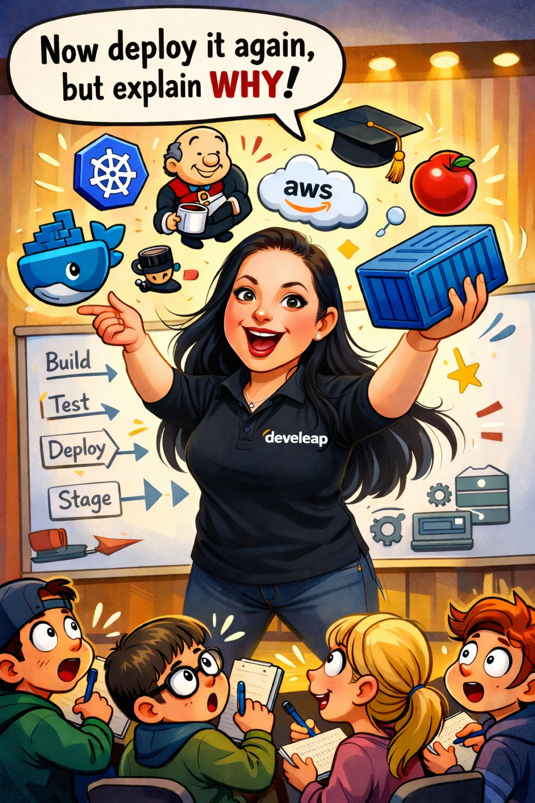

## Hey, I'm Carmit

I build cloud infrastructure and teach others how to do the same.

Lead DevOps instructor creating hands-on training where students deploy real applications to real clusters - not slideshows.

**What I Work With**

`Terraform` `AWS` `EKS` `Docker` `Jenkins` `ArgoCD` `Prometheus` `Grafana` `Python` `Helm` `Nginx` `MongoDB` `Redis` `GitHub Actions`

**Featured Projects**

**[Horsing Around](https://github.com/CarmitHaas/Horsing-Around)** - Flask + MongoDB + Docker + Jenkins CI/CD + EKS + ArgoCD GitOps + Prometheus + EFK
- [HA-infrastructure](https://github.com/CarmitHaas/HA-infrastructure) - Terraform EKS with custom modules
- [gitops-HA](https://github.com/CarmitHaas/gitops-HA) - ArgoCD App-of-Apps, Helm, SealedSecrets

**[Docker Learning Path](https://github.com/CarmitHaas?tab=repositories&q=docker)** - Progressive Docker & Compose exercises for beginners with hints and solution branches

**[repo-summarizer](https://github.com/CarmitHaas/repo-summarizer)** - FastAPI + multi-LLM GitHub repo analyzer

 

### Certifications

&nbsp;
&nbsp;
&nbsp;
&nbsp;
&nbsp;
&nbsp;
&nbsp;

### Teaching

I design exercises where you learn by breaking things and fixing them. The Docker exercises in my repos are used in real bootcamps - progressive difficulty, collapsible hints for when you're stuck, and solutions you can check after you've tried.

### Connect

[LinkedIn](https://www.linkedin.com/in/carmit-shemesh-haas) · carmithaas@gmail.com
